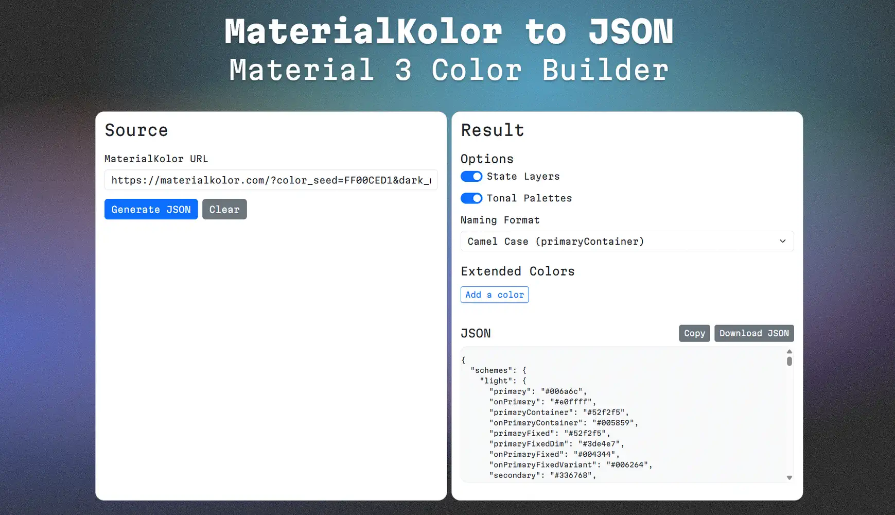

# MaterialKolor to json



https://vasiliy-dudin.github.io/MaterialKolor-to-json/

A tool for generating comprehensive Material Design 3 colour schemes from MaterialKolor.com URLs. Exports colour tokens in JSON format for seamless integration with design systems.

## What it does

- **🎯 MaterialKolor to JSON conversion** - Simply paste a MaterialKolor.com URL to instantly convert any palette to structured JSON format
- **🚀 Latest Google colour algorithm** - Uses the most current Material Design 3 colour generation library, while Material Theme Builder still relies on outdated algorithms
- **📝 Flexible naming conventions** - Export with camelCase, kebab-case, or Title Case naming to match your coding standards
- **🎨 Custom brand colours** - Add your own colours like warning, success, or brand-specific colours
- **📊 Complete palette generation** - Creates full tonal palettes (0-100 tones) and interaction states (hover, focus, pressed) with proper opacity values

## For designers and frontend developers

This tool is particularly useful for customising design system layouts in Figma. The generated JSON can be imported as Figma variables or design tokens using plugins.

The structured output ensures consistency across your design system and development workflow.

## Output format

```json
{
  "colors": {
    "primary": "#6750A4",
    "onPrimary": "#FFFFFF",
    "primaryContainer": "#EADDFF"
  },
  "stateLayers": {
    "primary": {
      "hover": "#6750A414",
      "focus": "#6750A41F"
    }
  },
  "tonalPalettes": {
    "primary": {
      "0": "#000000",
      "10": "#21005D",
      "20": "#381E72"
    }
  }
}
```
